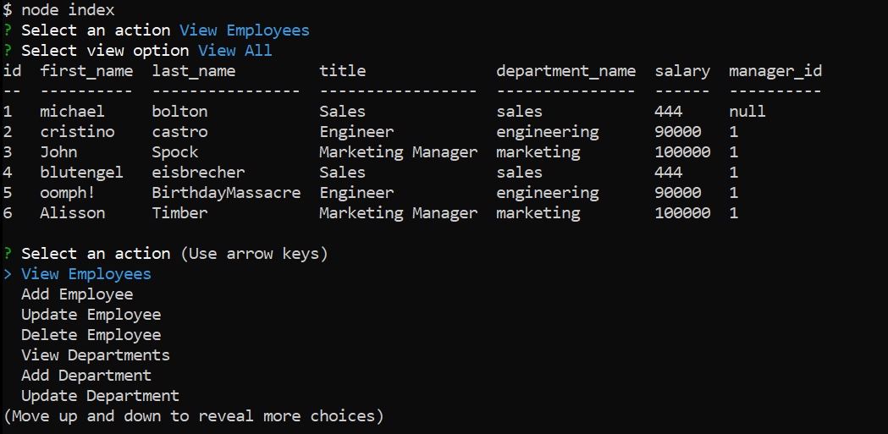
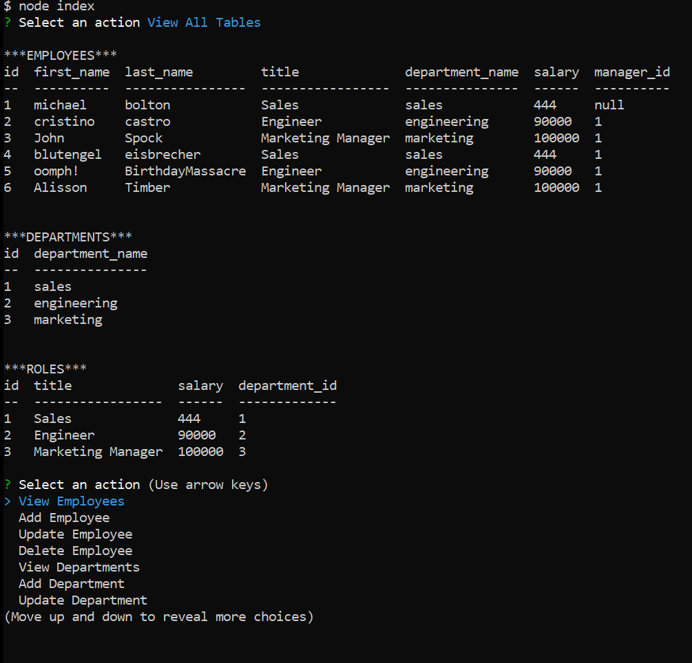

# 12-Employee-Tracker
Track your organization's employees in a database and CLI interface. 

## Description
This app uses node.js and the "inquirer" package to create a series of questions for the user. 
The user may create, read, update, or delete entries in the database. There are 3 tables in the database: employees, departments, and roles tables.

The application can also be run in debug and clean modes. Debug mode shows additional console messages to aid in debugging. Clean mode removes all console logs that display helpful information. Only query responses are shown.
To run debug mode: node index debug
To run clean mode: node index clean

## Accessing the application
Install node.js and run index.js. Select from the menu options:

- View, Add, Update, Delete employee entries
- View, Add, Update, Delete role entries
- View, Add, Update, Delete department entries
- View department budget
- Clear tables

## Screenshots of the Application

## Repository and Video Demo

The video is available here: [video-demo](https://youtu.be/xybI3pLzSBg)
The repo is available here: [repo](https://github.com/cristino4/12-employee-tracker)

